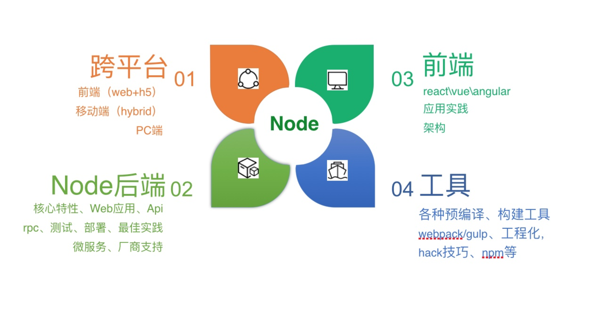

### 安装Node.js环境 3m安装法 
- nvm（node version manager）【需要使用npm安装，替代品是yrm（支持yarn）】 
- nrm（node registry manager）【需要使用npm安装，替代品是yrm（支持yarn）】 
- npm（node packages manager）【内置，替代品是n或nvs（对win也支持）】
### 常用软件 
- 1）oh my zsh是我最习惯的shell，终端下非常好用 配合iterm2分屏 + spectacle全屏，几乎无敌
- 2）brew是mac装软件非常好的方式，和apt-get、rpm等都非常类似 安装4个必备软件 - brew install git 最流行的SCM源码版本控制软件 - brew install wget 下载、扒站神器 - brew install ack 搜索代码神器 - brew install autojump 终端下多目录跳转神器 
- 3）vim 我虽然不算vim党，但也深爱着。janus是一个非常好用的vim集成开发环境。比如ctrl-p、nerdtree等插件都集成了，对我这种懒人足够了。

自己 Mac + Node.js 电脑初始化开发环境的安装脚本 [https://github.com/i5ting/i5ting-mac-init](https://github.com/i5ting/i5ting-mac-init)

值得一学，我推荐VSCode编辑器！

更多调试方法，参见[https://github.com/i5ting/node-debug-tutorial](https://github.com/i5ting/node-debug-tutorial)



- 1）跨平台：覆盖你能想到的面向用户的所有平台，传统的PC Web端，以及PC客户端 `nw.js/electron` 、移动端 `cordova`、HTML5、`react-native`、`weex`，硬件 `ruff.io` 等
- 2）Web应用开发：网站、Api、RPC服务等
- 3）前端：三大框架 React \ `Vue` \ `Angular` 辅助开发，以及工程化演进过程（使用`Gulp` /Webpack 构建 Web 开发工具）
- 4）工具：`npm`上各种工具模块，包括各种前端预编译、构建工具 `Grunt` / `Gulp`、脚手架，命令行工具，各种奇技淫巧等

Node.js 应用场景非常丰富，比如 Node.js 可以开发操作系统，但一般我都不讲的，就算说了也没多大意义，难道大家真的会用吗？一般，我习惯将 Node.js 应用场景氛围7个部分。

1）初衷，server端，不想成了前端开发的基础设施
2）命令行辅助工具，甚至可以是运维
3）移动端：cordova，pc端：nw.js和electron
4）组件化，构建，代理
5）架构，前后端分离、api proxy
6）性能优化、反爬虫与爬虫
7) 全栈最便捷之路

a）Error-first Callback
定义错误优先的回调写法只需要注意2条规则即可：

- 回调函数的第一个参数返回的error对象，如果error发生了，它会作为第一个err参数返回，如果没有，一般做法是返回null。
- 回调函数的第二个参数返回的是任何成功响应的结果数据。如果结果正常，没有error发生，err会被设置为null，并在第二个参数就出返回成功结果数据。

下面让我们看一下调用函数示例，Node.js 文档里最常采用下面这样的回调方式：

```js
function(err, res) {
  // process the error and result
}
```

这里的 `callback` 指的是带有2个参数的函数："err"和 "res"。语义上讲，非空的“err”相当于程序异常；而空的“err”相当于可以正常返回结果“res”，无任何异常。

b）EventEmitter

事件模块是 Node.js 内置的对观察者模式“发布/订阅”（publish/subscribe）的实现，通过`EventEmitter`属性，提供了一个构造函数。该构造函数的实例具有 `on` 方法，可以用来监听指定事件，并触发回调函数。任意对象都可以发布指定事件，被 `EventEmitter` 实例的 `on` 方法监听到。

在node 6之后，可以直接使用`require('events')`类

```js
var EventEmitter = require('events')
var util = require('util')

var MyEmitter = function () {
 
}

util.inherits(MyEmitter, EventEmitter)

const myEmitter = new MyEmitter();

myEmitter.on('event', (a, b) => {
  console.log(a, b, this);
    // Prints: a b {}
});

myEmitter.emit('event', 'a', 'b');
```

和jquery、vue里的Event是非常类似的。而且前端自己也有EventEmitter。

c）如何更好的查Node.js文档 API是应用程序接口Application Programming Interface的简称。从Node.js异步原理，我们可以知道，核心在于 Node.js SDK 中API调用，然后交由EventLoop（Libuv）去执行，所以我们一定要熟悉Node.js的API操作。 Node.js的API都是异步的，同步的函数是奢求，要查API文档，在高并发场景下慎用。 笔者推荐使用 [Dash]([https://kapeli.com/dash](https://kapeli.com/dash)) 或 [Zeal]([https://zealdocs.org/](https://zealdocs.org/)) 查看离线文档，经常查看离线文档，对Api理解会深入很多，比IDE辅助要好，可以有效避免离开IDE就不会写代码的窘境。

Bluebird是 Node.js 世界里性能最好的Promise/a+规范的实现模块，Api非常齐全，功能强大，是原生Promise外的不二选择。

好处如下：

- 避免Node.js内置Promise实现 问题，使用与所有版本兼容
- 避免Node.js 4曾经出现的内存泄露问题
- 内置更多扩展，timeout、 promisifyAll等，对Promise/A+规范提供了强有力的补充
限于时间关系，这里就不一一列举了，还是那句话，在学习Node.js过程中，对于Promise了解多深入都不过分。 推荐学习资料 - Node.js最新技术栈之Promise篇 [https://cnodejs.org/topic/560dbc826a1ed28204a1e7de](https://cnodejs.org/topic/560dbc826a1ed28204a1e7de) - 理解 Promise 的工作原理 [https://cnodejs.org/topic/569c8226adf526da2aeb23fd](https://cnodejs.org/topic/569c8226adf526da2aeb23fd) - Promise 迷你书 [http://liubin.github.io/promises-book/](http://liubin.github.io/promises-book/)

小结

这部分共讲了4个小点，都是极其直接的必须掌握的知识点。

- 1) 异步流程控制学习重点
- 2）Api写法：Error-first Callback 和 EventEmitter
- 3）中流砥柱：Promise 
- 4）终极解决方案：Async/Await
----------

这里再提一下关于Node.js源码阅读问题，很多人api都还没完熟练就去阅读源码，这是非常不赞成的，不带着问题去读源码是比较容易迷失在大量代码中的。效果并不好。

先用明白，然后再去阅读Node.js源码，然后探寻libuv并发机制。很多人买了朴大的《深入浅出Node.js》一书，看了之后还是不太会用，不是书写的不好，而是步骤不对。

- Node in action和了不起的Node.js是入门的绝好书籍，非常简单，各个部分都讲了，但不深入，看了之后，基本就能用起来了
- 当你用了一段之后，你会对Node.js的运行机制好奇，为啥呢？这时候去读朴大的《深入浅出Node.js》一书就能够解惑。原因很简单，九浅一深一书是偏向底层实现原理的书，从操作系统，并发原理，node源码层层解读。如果是新手读，难免会比较郁闷。
- 实践类的可以看看雷宗民（老雷）和赵坤（nswbmw）写的书

我一般给大家的推荐是把Node in action读上5遍10遍，入门干活足够了。剩下的就是反复实践，多写代码和npm模块就好。

### Web编程要点

一般，后端开发指的是 Web 应用开发中和视图渲染无关的部分，主要是和数据库交互为主的重业务型逻辑处理。但现在架构升级后，Node.js 承担了前后端分离重任之后，有了更多玩法。从带视图的**传统Web应用**和**面向Api接口应用**，到通过 RPC 调用封装对数据库的操作，到提供前端 Api 代理和网关，服务组装等，统称为**后端开发**，不再是以往只有和数据库打交道的部分才算后端。这样，就可以让前端工程师对开发过程可控，更好的进行调优和性能优化。

对 Node.js 来说，一直没有在后端取得其合理的占有率，原因是多方面的，暂列几条。

- 1）利益分配，已有实现大多是Java或者其他语言，基本是没法撼动的，重写的成本是巨大的，另外，如果用Node写了，那么那些写Java的人怎么办？抢人饭碗，这是要拼命的。
- 2）Node相对年轻，大家对Node的理解不够，回调和异步流程控制略麻烦，很多架构师都不愿意花时间去学习。尽管在Web应用部分处理起来非常简单高效，但在遇到问题时并不容易排查定位，对开发者水平要求略高。
- 3）开发者技能单一，很多是从前端转过来的，对数据库，架构方面知识欠缺，对系统设计也知之不多，这是很危险的，有种麻杆打狼两头害怕的感觉。
- 4）Node在科普、培训、布道等方面做的并不好，国外使用的非常多，国内却很少人知道，不如某些语言做得好。

尽管如此，Node.js 还是尽人皆知，卷入各种是非风口，也算是在大前端浪潮中大红大紫。原因它的定位非常明确，补足以 JavaScript 为核心的全栈体系中服务器部分。开发也是人，能够同时掌握并精通多门语言的人毕竟不多，而且程序员的美德是“懒”，能使用 JavaScript 一门语言完成所有事儿，为什么要学更多呢？

我们可以根据框架的特性进行分类

| 框架名称 | 特性 | 点评 |
| --- | --- | --- |
|  Express | 简单、实用，路由中间件等五脏俱全  | 最著名的Web框架|
|  Derby.js && Meteor | 同构 | 前后端都放到一起，模糊了开发便捷，看上去更简单，实际上上对开发来说要求更高  |
| Sails、Total | 面向其他语言，Ruby、PHP等 |  借鉴业界优秀实现，也是 Node.js 成熟的一个标志|
| MEAN.js | 面向架构 | 类似于脚手架，又期望同构，结果只是蹭了热点  |
| Hapi和Restfy | 面向Api && 微服务 | 移动互联网时代Api的作用被放大，故而独立分类。尤其是对于微服务开发更是利器  |
|  ThinkJS | 面向新特性 | 借鉴ThinkPHP，并慢慢走出自己的一条路，对于Async函数等新特性支持，无出其右，新版v3.0是基于Koa v2.0的作为内核的  |
|  Koa | 专注于异步流程改进 | 下一代Web框架  |
|  Egg | 基于Koa，在开发上有极大便利  | 企业级Web开发框架  |

Web编程核心

- 异步流程控制（前面讲过了）
- 基本框架 Koa或Express，新手推荐Express，毕竟资料多，上手更容易。如果有一定经验，推荐Koa，其实这些都是为了了解Web编程原理，尤其是中间件机制理解。
- 数据库 mongodb或mysql都行，mongoose和Sequelize、bookshelf，TypeOrm等都非常不错。对于事物，不是Node.js的锅，是你选的数据库的问题。另外一些偏门，想node连sqlserver等估计还不成熟，我是不会这样用的。
- 模板引擎， ejs，jade，nunjucks。理解原理最好。尤其是extend，include等高级用法，理解布局，复用的好处。其实前后端思路都是一样的。

1、计算机基础薄弱该如何完善自己的知识体系？

答:追逐长尾，所见所闻不懂的都去学就好啦。我是这样过来的，头几年每天14个小时+，很累，不过效果还可以。os，算法，数据结构，设计模式，编译原理，基本也就这些重点。做到每天都有进步就好，别贪多求快。数学和英文当然也是越狠越好的！

3、如何系统的学习node？ 答:阶段 1/要会用，能完成工作任务 2/写点提高效率的工具 3/参与开源项目，甚至是node源码 应对方法 1/《node in action》看五遍，然后就去写吧，别管代码质量如何，能写敢写 2/多用些模块，理解它们，如果有机会就自己写一下，万一有很多人用你，我小弟写过一个地区选择加载的json数据，star数不少呢 3/给别人贡献代码，要去学别人的习惯，网上有git标准工作流和提pr方法，你要做的是精研该模块代码，关注issue，其他就是等机会。另外朴灵的深入浅出多读几遍，试着读node源码，你的理解会更好。推荐看看我写的《通过开源项目去学习》[https://github.com/i5ting/Study-For-StuQ](https://github.com/i5ting/Study-For-StuQ) 4/跳出node范围，重新审视node的应用场景，对未来你的技术选项和决策大有裨益

关于 Node 的书几乎都过时了，我该买哪本？

答：
1）Node in action和了不起的Node.js是入门的绝好书籍，非常简单，各个部分都讲了，但不深入，看了之后，基本就能用起来了
2）当你用了一段之后，你会对Node.js的运行机制好奇，为啥呢？这时候去读朴大的《深入浅出Node.js》一书就能够解惑。原因很简单，九浅一深一书是偏向底层实现原理的书，从操作系统，并发原理，node源码层层解读。如果是新手读，难免会比较郁闷。
3)实践类的可以看看雷宗民（老雷）和赵坤（nswbmw）写的书

如果你不着急，也可以等我的那本《更了不起的Node.js》，预计明年3月之后。

Node Web 框架那么多，我该怎么选？

答：初学者推荐Express，如果有一定经验，推荐Koa。当然真正项目里还是推荐Eggjs和Thinkjs这样的框架。


### 从前端转

从前端往后端转，api 接口非常容易学会，像 express、koa 这类框架大部分人一周就能学会，最难的是对 db、er 模型的理解，说直白点，还是业务需求落地的理解

我们来想想一般的前端有什么技能？

- html
- css（兼容浏览器）
- js 会点（可能更多的是会点 jquery）
- ps 切图
- firebug 和 chrome debuger 会的人都不太多
- 用过几个框架，大部分人是仅仅会用
- 英语一般
- svn/git 会一点

那么他们如果想在前端领域做的更深有哪些难点呢？

- 基础：oo，dp，命令，shell，构建等
- 编程思想上的理解（mvc、ioc，规约等）
- 区分概念
- 外围验收，如 H5 和 hybird 等
- 追赶趋势，如何学习新东西

以上皆是痛点，所以比较好的办法应该是这样的。

- 玩转 npm、gulp 这样的前端工具类（此时还是前端）
- 使用 node 做前后端分离（此时还是前端）
- express、koa 这类框架
- jade、ejs 等模板引擎
- nginx
- 玩转【后端】异步流程处理（promise/es6的(generator|yield)/es7(async|await)）
- 玩转【后端】mongodb、mysql 对应的 Node 模块

从我们的经验看，这样是比较靠谱的。先做最简单前后端分离，里面没有任何和db相关，前端可以非常容易的学会，基本2周就已经非常熟练了。一般半年后，让他们接触【异步流程处理】和【数据库】相关内容，学习后端代码，就可以全栈了。

招人标准 先说下我的招人标准，做技术总监时上指下派只要看好技术能力和态度即可，做CTO时要考虑团队文化，人品和能否在公司长留，所以不同的人面试要看的点是不一样的，我曾面过很多Node.js程序员，也见过很多面试题，汇总一下，大致有以下9个点： 1\. 基本的Node.js几个特性，比如事件驱动、非阻塞I/O、Stream等 2\. 异步流程控制相关，Promise是必问的 3\. 掌握1种以上Web框架，比如Express、Koa、Thinkjs、Restfy、Hapi等，会问遇到过哪些问题、以及前端优化等常识 4\. 数据库相关，尤其是SQL、缓存、Mongodb等 5\. 对于常见Node.js模块、工具的使用，观察一个人是否爱学习、折腾 6\. 是否熟悉linux，是否独立部署过服务器，有+分 7\. js语法和es6、es7，延伸CoffeeScript、TypeScript等，看看你是否关注新技术，有+分 8\. 对前端是否了解，有+分 9\. 是否参与过或写过开源项目，技术博客、有+分 补充一句:只看技能没人品的人，千万别招，白脸狼

能否推荐点 nodejs 相关的博客
[sindresorhus/awesome-nodejs]([https://github.com/sindresorhus/awesome-nodejs](https://github.com/sindresorhus/awesome-nodejs))。

